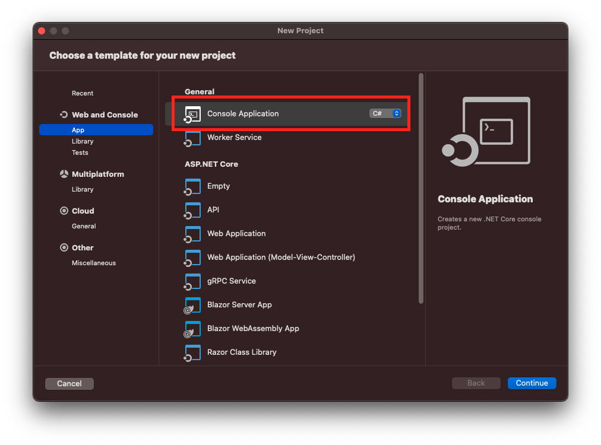
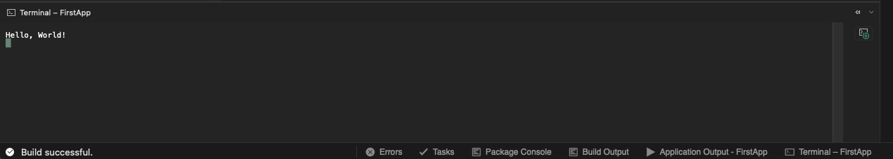

# C# Learning Camp
This repo is an area to document my learning of C#.

## Challenge 1 : Running on Mac

C# is usually used within a Windows environment and while I do have a Windows machine whats the fun in not using my mac and adding extra steps.
First stop to learn how to compile C# documents is old reliable [stackoverflow](https://stackoverflow.com/questions/28280082/can-i-program-in-c-sharp-on-a-mac?noredirect=1&lq=1). Visual Studio for Mac will be needed then, I will see if I can run it in VSC because I'm stuborn. 
To download Visual Studio you can download [here](https://visualstudio.microsoft.com/thank-you-downloading-visual-studio-mac/?sku=communitymac&rel=17). You will need roughly 2-5 GBs of storage depending on what packages you'd like to install. 

## Challenge 2: Hello, World

Time has come writing my first piece of C# code, "Hello, World". Riveting stuff. The code wasn't the issue at this point, running the code on the other hand is completely diferent task. 
~~I created a new project [learning](./Learning/) which generated a lot of code. All that I need is the following, I think.~~

~~using System;~~

~~namespace Learning~~
~~{~~
~~class HelloWorld~~
~~{~~
~~static void Main(string[] args)~~
~~{~~
~~    Console.WriteLine("Hello, World!");~~
~~}~~
~~}~~
~~}~~

~~now all that's left is to run, so I hit Build in top left corner and the build failed...~~
~~ So I went to the Build menu and select Rebuild Solution and it built successfully, I couldn't figure out how to get it to run. ~~

Scratch that I built my project wrong and I could refactor my code to a single line. 
    Console.WriteLine("Hello, World!");

So when creating a project you need to ensure you select **console app**

Now I am a C# coder. To run the code click the play icon in the top ledt corner of the windows.

    Console.WriteLine("Hello, World!");

## Challenge 3: Some coding challenges
To begin learning more aspects of C# I decided to use the microsoft [self guided tutorial](https://docs.microsoft.com/en-ie/users/dotnet/collections/yz26f8y64n7k07?WT.mc_id=dotnet-35129-website). I went with the **Take your first steps with C#** tutorial. 
**Spoiler Alert**
The browser has an in-built code editor which can be used to run code however to track my work I decided to add it to this repo to track my progress.
I have found that C# is case sensitive.
    Console.WriteLine("Hello, World!");

Throws the error

    (1,1): error CS0103: The name 'console' does not exist in the current context

To finish the tutorial there is a quick quiz, I passed with flying colours. 

I went back to the [the video tutorials](https://dotnet.microsoft.com/en-us/learn/videos) and ran through the first 10 in an hour and they were great. Most of the time I don't like video tutorials however these I enjoyed. I learnt about Strings, numbers and branches. I still have to finish off the tutorial but we should have a good base if I complete these tutorials. 

Majority of the points are straight forward if you have previous programming knowledge. 

## Challenge 4: Find Coding projects to wirte

